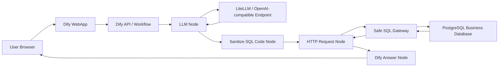

# Project Report Template

Use this template when asked to create a Markdown project report for a Dify NL2SQL Docker setup. Replace placeholders with the actual values from the environment. Do not include real secrets in a report intended for a public repository.

## Title

```markdown
# Dify Docker NL2SQL Project Report

Generated date: <YYYY-MM-DD>
```

## 1. Objective

Describe the goal:

```text
Build a local Dify NL2SQL proof of concept where users ask natural language questions, an LLM generates PostgreSQL SELECT statements, and a safe HTTP execution gateway queries a read-only business database.
```

## 2. Deployed Components

Use a table:

```markdown
| Component | Container or URL | Purpose |
| --- | --- | --- |
| Dify Web | `<container>` | Dify frontend |
| Dify API | `<container>` | Workflow runtime and console API |
| Dify PostgreSQL | `<container>` | Dify metadata database |
| Dify Plugin Daemon | `<container>` | Model provider plugins |
| LiteLLM | `<container or URL>` | OpenAI-compatible model gateway |
| Business PostgreSQL | `<container>` | NL2SQL target database |
| SQL Gateway | `<container>` | Validates and executes read-only SQL |
| pgAdmin | `<container or desktop>` | Database inspection |
```

## 3. Model Configuration

Include:

```text
Provider: OpenAI-API-compatible
Provider ID: langgenius/openai_api_compatible/openai_api_compatible
Model: <model-id>
Endpoint from Dify: <endpoint-url>
Mode: chat
```

Do not print the real API key. Write:

```text
API Key: configured in Dify, omitted from this report
```

## 4. Database Configuration

Separate Dify metadata database from the business database.

### Dify Metadata Database

```text
Host: <dify-db-host>
Port: <port>
Database: <database>
User: <user>
Purpose: stores Dify apps, workflows, users, provider credentials, and site config
```

### Business Database

```text
Host from Docker: <business-db-container>:5432
Host from host OS: localhost:<published-port>
Database: <database>
Table: <table>
Runtime user: <readonly-user>
Admin user: <admin-user>
```

## 5. Business Schema

Document tables and business definitions:

```markdown
| Table | Column | Type | Meaning |
| --- | --- | --- | --- |
| orders | id | integer | Order ID |
| orders | order_date | date | Order date |
| orders | region | text | Region code |
| orders | product | text | Product code |
| orders | amount | numeric | Order amount |
| orders | status | text | paid or refund |
```

Business rules:

```text
Sales amount = SUM(amount) where status = 'paid'
Refund amount = SUM(amount) where status = 'refund'
```

## 6. Workflow Design

List workflow nodes:

```markdown
| Node | Type | Purpose |
| --- | --- | --- |
| Start | start | Receives the user query |
| Generate SQL | llm | Converts natural language to SQL |
| Sanitize SQL | code | Extracts a clean SQL string |
| Execute Safe SQL | http-request | Calls the SQL gateway |
| Parse Answer | code | Parses gateway response |
| Answer | answer | Returns result to user |
```

## 7. Architecture Diagram

Use Mermaid:



## 8. Dify-to-Database Communication

Make this the clearest section:

```text
Dify does not connect directly to the business database.
Dify sends sanitized LLM-generated SQL to an HTTP gateway.
The gateway validates the SQL and executes it with a read-only database account.
```

Include request shape:

```http
POST http://<gateway-host>:8080/execute
Content-Type: application/json

{"sql": "SELECT ... LIMIT 100"}
```

Include gateway response shape:

```json
{
  "answer": "...",
  "sql": "SELECT ...",
  "rows": []
}
```

## 9. Security Controls

Include:

- Dify does not store the business database password in workflow nodes.
- The SQL gateway uses a read-only user.
- SQL must be a single `SELECT`.
- Forbidden keywords are blocked.
- Only allowlisted tables are accepted.
- `LIMIT` is enforced.
- Production deployments should add auditing, per-user authorization, and secret management.

## 10. Validation Results

Include actual test questions and summarized answers:

```markdown
| Test Question | Expected Capability | Result |
| --- | --- | --- |
| Monthly sales trend | Time-series aggregation | Passed |
| Sales by region last month | Group by region | Passed |
| Refund amount by region | Status filter | Passed |
```

## 11. Operations and Troubleshooting

Include key commands:

```powershell
docker ps
docker logs <container>
docker exec <postgres-container> psql -U <user> -d <db> -c "SELECT COUNT(*) FROM orders;"
```

Mention pgAdmin host selection:

```text
desktop pgAdmin: localhost:<published-port>
Docker pgAdmin: <postgres-container>:5432
```

## 12. Next Steps

Examples:

- Move secrets to a secret manager.
- Add SQL AST validation.
- Add query audit logs.
- Add row-level and user-level authorization.
- Replace the local PostgreSQL container with a cloud database.
- Package the SQL gateway as a controlled internal service.

