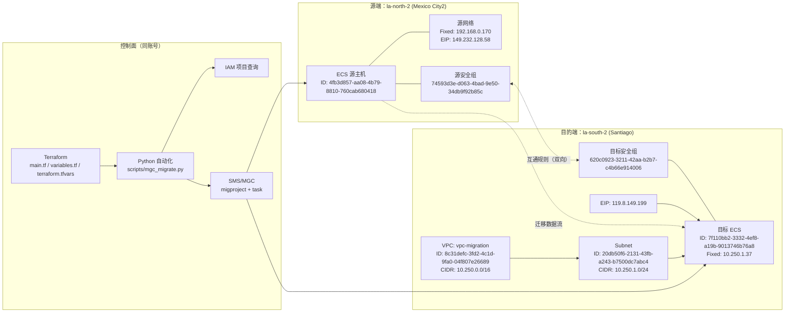
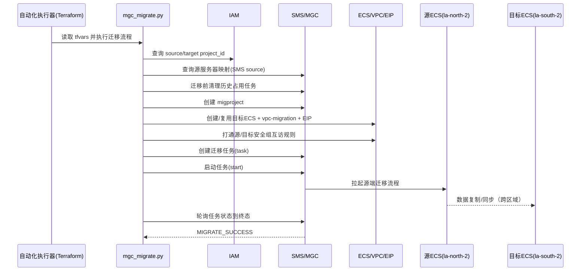

# 墨西哥城二 -> 圣地亚哥 跨区域迁移方案架构图（实战版）

## 1. 源/目的端架构与云服务信息

### 1.1 关键对象

- 源端 Region: `la-north-2`（Mexico City2）
- 目的端 Region: `la-south-2`（Santiago）
- 源 ECS ID: `4fb3d857-aa08-4b79-8810-760cab680418`
- 源 SMS ID: `dceb9146-c28f-4596-8c42-a55b068c31d5`
- 目标 ECS ID: `7f110bb2-3332-4ef8-a19b-9013746b76a8`
- 迁移项目 ID: `7a545883-187a-458d-aea0-6e665d295e2e`
- 迁移任务 ID: `5f044a0b-cf65-44b0-a816-9914c2b30c96`
- 目标 VPC: `vpc-migration`（`8c31defc-3fd2-4c1d-9fa0-04f807e26689`）
- 目标子网 ID: `20db50f6-2131-43fb-a243-b7500dc7abc4`（CIDR: `10.250.1.0/24`）
- 源固定 IP: `192.168.0.170`
- 源 EIP: `149.232.128.58`
- 目标固定 IP: `10.250.1.37`
- 目标 EIP: `119.8.149.199`

### 1.2 云服务清单

- IAM: 区域项目查询与鉴权
- SMS/MGC: 迁移项目、迁移任务创建与执行
- ECS: 源/目标虚拟机查询与目标机创建
- VPC: 目标 VPC/子网与安全组规则
- EIP: 目标 ECS 对外迁移通道
- EVS: 目标 ECS 系统盘/数据盘承载（由 ECS 创建流程带出）

### 1.3 源目的端架构图

## 2. 迁移路径图

## 3. 迁移步骤（执行版）

1. 参数准备：在 `terraform.tfvars` 填写 AK/SK、源机 ID、目标镜像、区域与网络参数。
2. 迁移前检查：确认源机已注册 SMS，检查目标 VPC 配额、镜像可用性。
3. 历史任务清理：按 `source_sms_id` 查询并删除占用源机的历史任务（本次删除 1 条）。
4. 执行迁移：
   - `terraform init`
   - `terraform apply -auto-approve`
5. 若返回 `No changes`，强制触发本轮迁移：
   - `terraform apply -replace=terraform_data.mgc_region_migration -auto-approve`
6. 目标侧自动动作：创建/确认 `vpc-migration`、目标 ECS、绑定 EIP、补齐安全组双向规则。
7. 创建并启动 SMS 任务：生成 `migproject_id`、`task_id` 并开始迁移。
8. 状态跟踪：轮询任务状态，直到终态（本次终态 `MIGRATE_SUCCESS`）。
9. 迁移后校验：目标 ECS `ACTIVE`、EIP 存在、源/目标安全组互通通过。

## 4. 迁移总结

- 结果：迁移成功，任务终态 `MIGRATE_SUCCESS`。
- 终态时间：`2026-04-22 07:28:21 +0800`。
- 关键保障动作：
  - 迁移前删除历史占用任务，避免 `SMS.7605` 类冲突。
  - 当 Terraform 无变更时使用 `-replace` 强制执行，避免“流程未触发”。
  - 迁移后执行网络与安全组校验，确保可连通性闭环。
- 经验结论：
  - `progress` 字段可长期为 `null`，以任务 `state` 终态为准。
  - 生产流程应固化为：`预清理 -> 执行 -> 终态轮询 -> 后置网络校验 -> 打包归档`。
